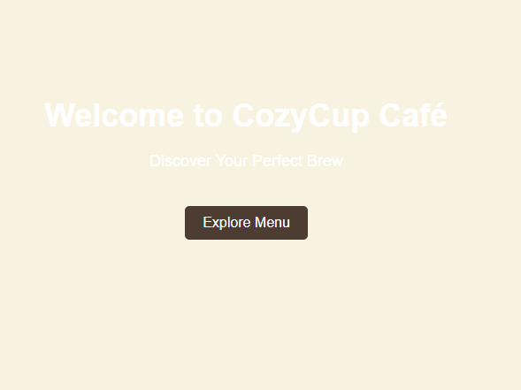
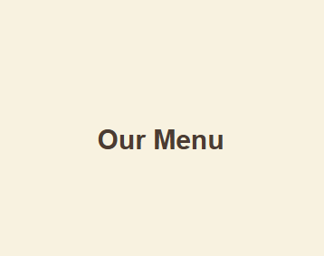
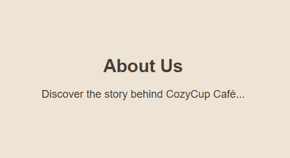
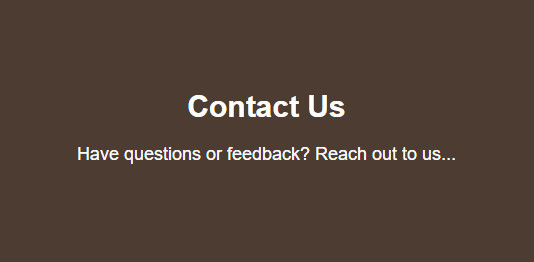

# Cozy Cup Cafe

## Project Description

Cozy Cup Cafe is a cool website.
The project presents the cafe's menu, ambiance, and customer services.

## Features

- User friendly website
- Simple Website design
- Organized menu for food and beverages
- Contact page with location info

## Screen Captures

 
<strong>Home Page:</strong> Welcomes visitors with a cozy café introduction and menu.
  

 
<strong>Menu Page:</strong> Shows the relaxing and inviting atmosphere of the café.
  

 
<strong>About Us Page:</strong> Shares information about the café and its background.
  

 
<strong>Contact Us Page:</strong> Provides contact details and location.

## About the Authors

**Name:** Mark David Dalupan  
**Email:** 201880072@psu.palawan.edu.ph

